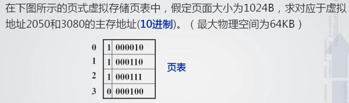

# 第3章-习题

> 哈佛结构指的是？

数据和指令分别存放

-----

> 【虚拟存储器】
>
> <left>
>     
> </left>

页面大小为$1KB$，代表**页内偏移地址**为10位

$(2050)_{10}=(10\quad 0000000010)_2$，后10位对应页内偏移地址，高2位对应页号
所以虚页号为2，查表得到物理页号为$000111$，则对应物理地址为：$000111\quad 0000000010$

-----

