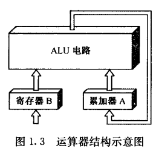
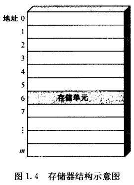
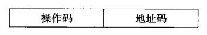
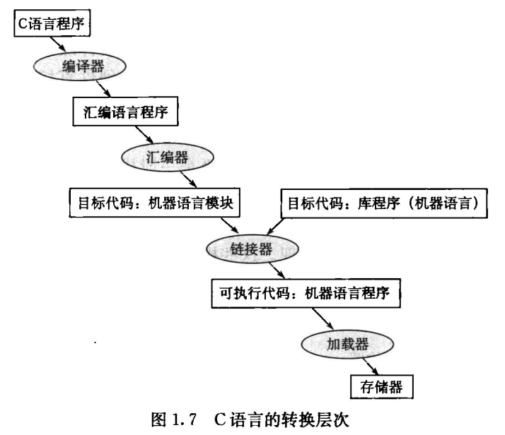
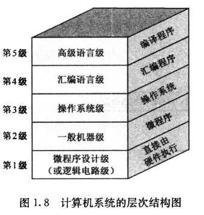

# 第一章 计算机系统概述

## 1.3 计算机的硬件

数字计算机的基本组成：控制器、运算器、存储器、输入设备、输出设备

### 计算机的组成结构

#### 运算器（ALU）

- 进行算术运算与逻辑运算
- 二进制运算
- 运算器长度一般是8位、16位、32位、64位

    

#### 存储器

- 存储数据和程序（指令）
- 容量：保存一个数的若干个半导体触发器称为一个**存储单元**。每个存储单元都有编号，称为**地址**
- 分类：半导体存储器容量有限，称为**内存**（ROM,RAM）；磁盘存储器、光盘存储器容量更大，称为**外存**
- 存储器单位：bit(位)，byte(字节)，KB(千比特)，MB(兆比特)，GB(吉比特)，TB
  - 1 byte = 8 bit
  - 1 GB = 1024 MB = 1024\*1024 KB = 1024\*1024\*1024 B
  - 一个“字”至少由一个以上的字节组成，通常把组成一个字的二进制位数叫做**字长**

    

#### 控制器

- 指令：每一条基本操作就叫做一条**指令**。解决某一问题的一串指令序列，叫做该问题的**计算程序**

  - 指令形式：指令需要告诉控制器，从存储器的哪个单元取数，并进行何种操作，因此一条指令的内容分为两部分，即操作的性质和操作数的地址

    

        
    

- **冯诺依曼型结构**：将指令序列存放到存储器中并称为**存储程序**，而控制器依据存储的程序来控制计算器完成计算任务叫做**程序控制**，存储程序并按地址顺序执行，就是冯诺依曼型计算机的设计思想（<u>指令和数据放在同一个存储器</u>）

  哈佛结构：<u>指令和数据分别放在两个存储器中</u>，显然哈佛结构速度更快

- 基本任务：按照一定的顺序一条接着一条取指令、指令译码、执行指令。通常把取指令的一段时间叫做**取指周期**，而把执行指令的一段时间叫做**执行周期**。

- 指令流与数据流：一般来讲，取指周期中从内存读出的信息流是**指令流**，它流向控制器；而在执行器周期中从内存读出的信息流是**数据流**，它由内存流向运算器。因此虽然都是二进制数码，但是控制器完全可以区分出数据字与指令字

## 1.4 计算机的软件

### 分类

系统程序：用来简化程序设计，简化使用方法，提高计算机的使用效率，发挥和扩大计算机的功能及用途

应用程序：用户利用计算机来解决某些问题而编制的程序

### 发展

编程语言发展：手编程序$\Rightarrow$汇编程序$\Rightarrow$高级程序

例：C语言程序通过**编译器**首先被编译为汇编语言程序，然后通过**汇编器**汇编为机器语言的目标模块。**链接器**将多个模块与库程序组合在一起以解析所有的应用。**加载器**将机器代码放入合适的内存位置以便处理器执行

	

## 1.5 计算机系统的层次结构

    

- 固件：功能上是软件，形态上是硬件

## 补充

### 加速比

$$
Fe=\frac{可改进部分占用时间}{改进前整个任务执行时间},Fe<1\\[3ex]
Se=\frac{改进前改进部分执行时间}{改进后改进部分执行时间},Se>1
$$

1. 改进后整个任务执行时间$T_n$：
   $$
   T_n=T_0(1-Fe+\frac{Fe}{Se})
   $$
   $T_0$为改进前整个任务执行时间

2. 改进前后整个系统的加速比$S_n$：
   $$
   S_n=\frac{T_0}{T_n}=\frac{1}{(1-Fe)+\frac{Fe}{Se}}
   $$

#### 例题

>  新CPU的处理速度为原CPU的10倍，已知原CPU 40%的时间用于计算，60%的时间等待I/O，求使用新CPU后的加速比

$$
Fe=\frac{0.4}{1}=0.4(I/O部分CPU不工作，无法改进)\\[3ex]
S_n=\frac{1}{(1-0.4)+\frac{0.4}{10}}=\frac{1}{0.64}
$$

### CPU性能公式

- 性能三要素：时钟频率$f$（时钟周期$T=1/f$），每条指令时钟周期数；指令条数$IC$

- CPU时间（一个程序执行时间）=$CPU$时钟周期总数\*时钟周期$T$
  $$
  CPU时间=\frac{CPU时钟周期总数}{时钟频率f}
  $$

- 每条指令平均时钟周期数$CPI$：
  $$
  CPI=\frac{CPU时钟周期总数}{IC}
  $$
  因此，CPU时间也可以表示成：$CPU时间=IC*CPI*T$

