# 第2章-运算方法和运算器

## 1. 数据表示

### 定点数

    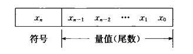

定点小数范围：$-1<X<1$

定点整数范围：$-(2^n-1)\le X\le (2^n-1)$

    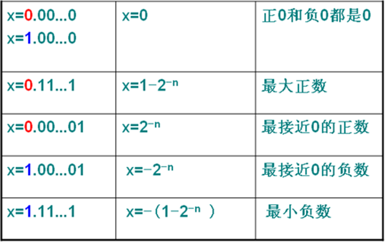

### 浮点数

    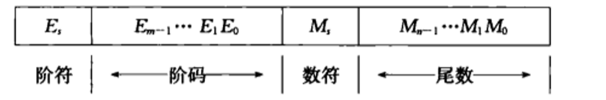

#### IEEE754标准

    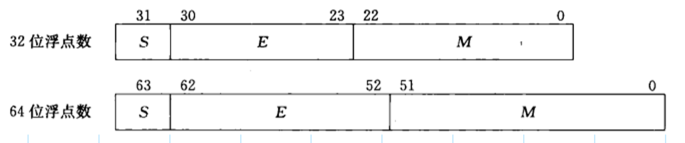

其中，$S$是浮点数的**符号位**，0为正数，1为负数；$M$是**位数**，小数点放在尾数域最左有效位的右边；$E$是**阶码**，用移码方式表示指数

因此，一个规格化的浮点数$X$的**真值**为：
$$
32位：X=(-1)^S\times (1.M)\times 2^{E-127},\ e=E-127\\
64位：X=(-1)^S\times (1.M)\times 2^{E-1023},\ e=E-1023
$$

### 机器码

|      |        原码         |           反码            |              补码              |             移码             |
| :--: | :-----------------: | :-----------------------: | :----------------------------: | :--------------------------: |
| 正数 | 符号位为0，其余不变 |        与原码相同         |           与原码相同           | 数值位与补码相同，符号位相反 |
| 负数 | 符号位为1，其余不变 | 符号位为1，数值位按位取反 | 符号位为1，数值位按位取反后加1 | 数值位与补码相同，符号位相反 |

### 校验码

奇校验位：$\overline C=x_0\oplus x_1\oplus\dots\oplus x_{n-1}$

偶校验位：$ C=x_0\oplus x_1\oplus\dots\oplus x_{n-1}$

$\oplus$代表按位加，当$X$中包含奇数个1时，奇校验位$\overline C=1$，即$C=0$；当$X$中包含偶数个1时，偶校验位$C=0$

假设一个字$X$从$A$从到$B$，在源点$A$可以计算出校验位，然后一起将$(x_0x_1\dots x_{n-1}C)$送到$B$。假设$B$点真正接收到的$X=(x_0'x_1'\dots x_{n-1}' C')$，然后计算
$$
F=x_0'\oplus x_1'\oplus\cdots\oplus x_{n-1}' \oplus C'
$$
若$F=1$，则表明收到的信息有误

- 奇偶校验提供**奇数个错误检测**，无法检测偶数个错误，更无法识别错误信息的位置

## 2. 定点加法、减法运算

### 补码加法

$$
[x+y]_{补}=[x]_补+[y]_补\ (mod\ 2^{n+1})
$$

- 符号位要作为数的一部分一起参加运算
- 要在模$2^{n+1}$意义下相加，查过的进位要丢掉

> 

>     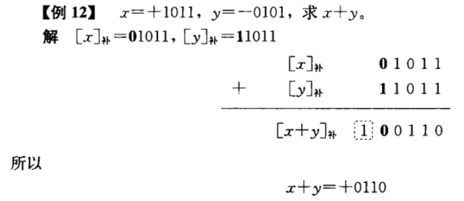
> 

### 补码减法

$$
[x-y]_{补}=[x]_{补}-[y]_{补}=[x]_{补}+[-y]_{补}
$$

- 从$[y]_{补}$求$[-y]_{补}$的方法：对$[y]_{补}$包括符号位“求反且最末尾加1”

> 

>     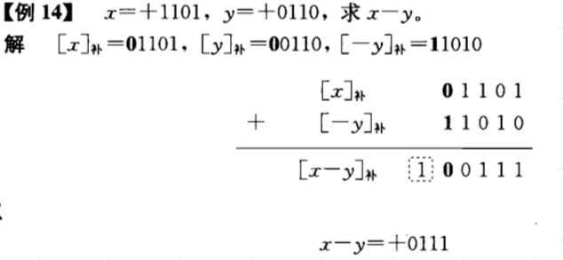
> 

### 溢出检测

采用**双符号位法**，此时补码形式为
$$
[x]_{补}=2^{n+2}+x\ (mod\ 2^{n+2})
$$
采用变形补码后，任何正数，两个符号位都是`0`；任何负数，两个符号位都是`1`。如果两个数相加后，其结果的符号位出现`01`或`10`，则表示发生溢出。最高符号位永远表示结果的正确符号

> 

>     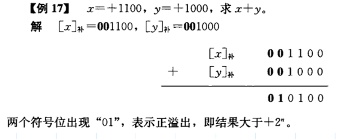
> 

## 3. 定点乘法

### 手工计算

    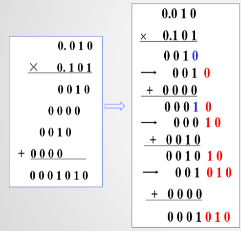

### 不带符号的阵列乘法器

    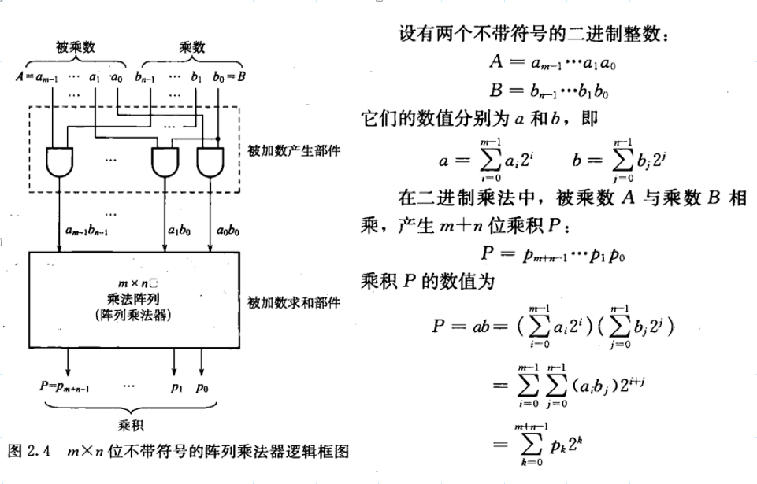

其阵列乘法器逻辑电路如下：

其中，$FA$的斜线方向为进位输出，竖线方向为和输出

    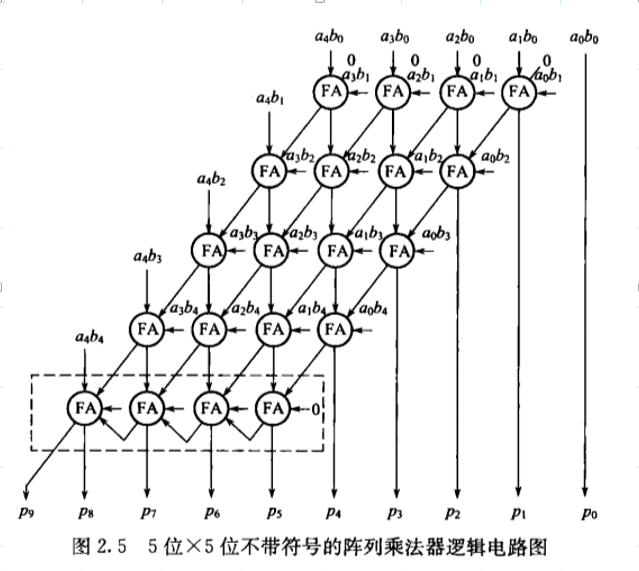

### 带符号的阵列乘法器

如果使用原码乘法，算前求补和算后求补都不需要

如果使用补码乘法，则最终结果需要再一次求补码

    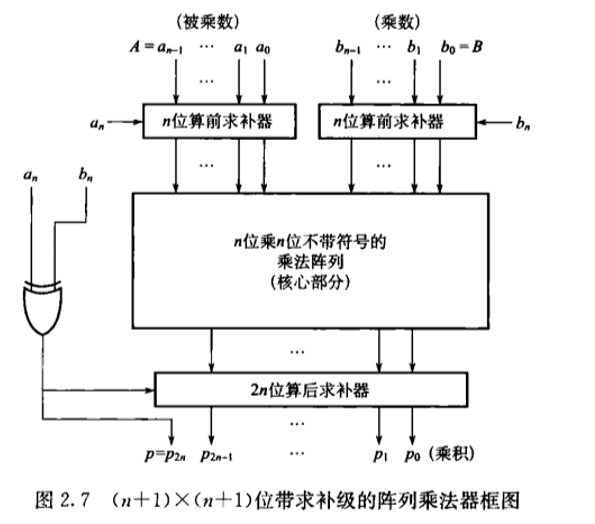

> 

>     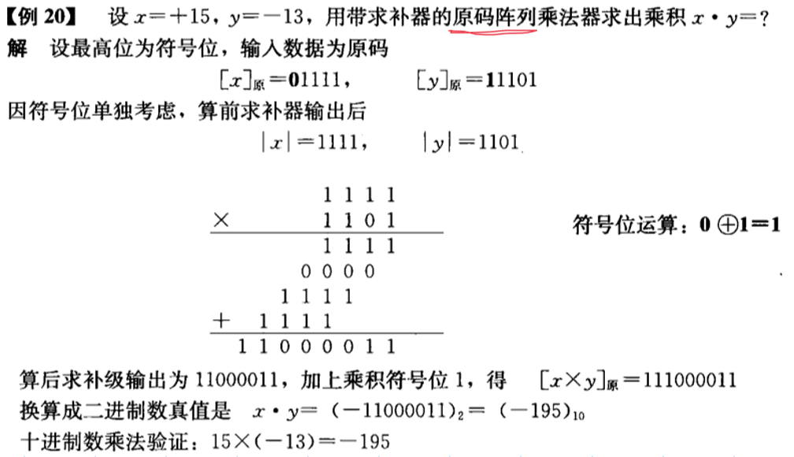
> 

>
> 

>     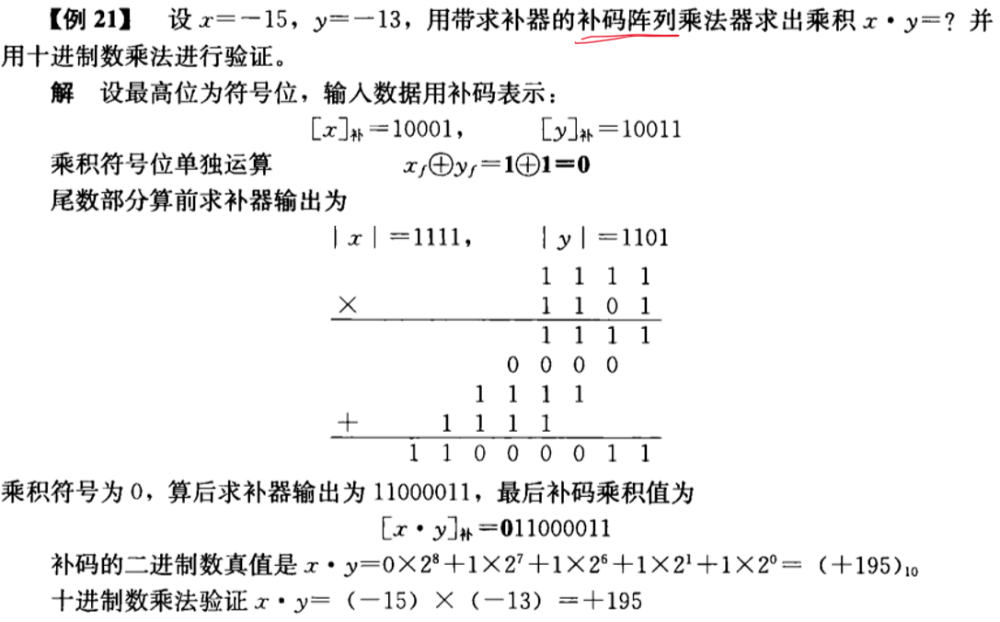
> 

## 4. 定点除法

### 手工计算

    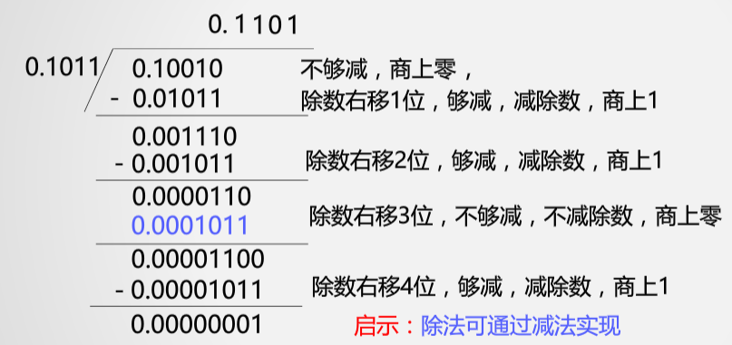

## 5. 浮点运算

设$x=2^{E_x}\cdot M_x,\ y=2^{E_y}\cdot M_y$

则：$x+y=(2^{E_x-E_y}\cdot M_x+M_y)\times 2^{E_y}\quad (E_y\ge E_x)$

步骤：

1. 0操作数检查

2. 比较阶码并完成对阶（小阶向大阶对齐）

   阶数小的，要将尾数右移$|\Delta E|$位，同时阶码加$|\Delta E|$

3. 尾数求和运算

4. 结果规格化

   <left>
       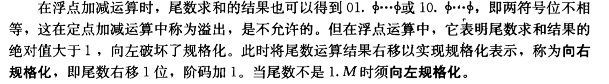
   </left>

5. 舍入处理

   就近舍入：丢弃的最高位为1，进1

> **例：**设$x=2^{010}\times 0.11011011,\ y=2^{100}\times(-0.10101100)$，求$x+y$
>
> 先用补码形式表示$x,y$  
> $[x]_{补}=00\ 010,\ 00.11011011$  
> $[y]_{补}=00\ 100,\ 11.01010100$
>
> 1. 对阶  
>    $[\Delta E]_{补}=[E_x]_{补}+[-E_y]_{补}=00\ 010+11\ 100=11\ 110$  
>    $\therefore \Delta E=-2$，即$x$的阶码小于$y$的阶码  
>    将$x$的尾数右移2位，同时阶码加2，对阶后$x$为$[x]_{补}=00\ 100,\ 00.00110110(11)$
>
> <left>
>     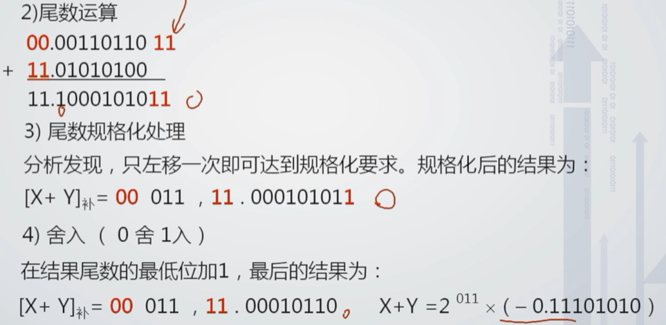
> </left>

