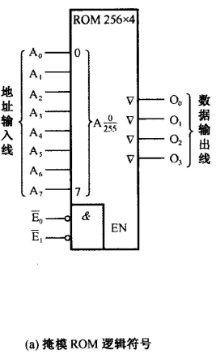
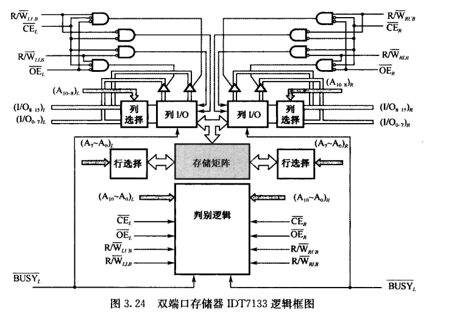

# 第3章 多层次的存储器

## 1. 存储器概述

- CPU能直接访问的存储器称为**内存储器**，包括cache和主存储器
  外存储器的信息必须调入内存储器后才能为CPU进行处理

    

- 存取时间、存取周期、存储器带宽是反映主存的速度指标

- 静态读写存储器($SRAM$)：存取速度快
- 动态读写存储器($DRAM$)：存储容量大

## 2. SRAM存储器

### 基本的静态存储元阵列

    

任何一个SRAM，都有三组信号线与外部打交道：

1. **地址线：**上图中有6条地址线，指定了**存储器的容量**是$2^6=64$个存储单元
2. **数据线：**上图中有4条数据线，指定了**存储器的字长**是4位，因此存储位元的总数是$64*4$
3. **控制线：**$R/\overline W$线控制线，指定了对存储器进行**读**（高电平）还是**写**（低电平)，读写操作不会同时发生

### SRAM逻辑结构

目前的SRAM芯片采用双译码方式，将地址分成$x$向、$y$向两部分，以便组织更大的存储容量

    
     
    

        存储容量为32K*8位(256*128*8)的SRAM逻辑结构图
    

地址线共15条，$x$方向8条$(A_0\sim A_7)$，经行译码输出256行。$y$方向7条$(A_8\sim A_{14})$，经列译码输出128列
数据线共8条，代表字长为8为，所以存储阵列为三维结构。

#### 读与写的互锁逻辑

- $\overline{CS}$是片选信号：$\overline{CS}$有效时(低电平)，门$G_1,G_2$均被打开
- $\overline{OE}$为读出使能信号：$\overline{OE}$有效时(低电平)，门$G_2$开启
- $\overline{WE}$是写命令：$\overline{WE}=1$时(高电平)，门$G_1$关闭，存储器进行读操作；$\overline{WE}=0$时，门$G_1$开启，门$G_2$关闭
- $G_1,G_2$是互锁的，不能同时打开

### 读写周期波形图(P68)

<left>
    
</left>

##  3. DRAM存储器

动态MOS随机读写存储器DRAM的**存储容量极大**，通常用作计算机的主存储器

### DRAM芯片的逻辑结构

    

由于DRAM存储器容量很大，地址线宽度相应要增加，势必会增加芯片地址线的管脚数目，所以采用**分时传送地址码**。
若地址总线宽度为10位，先传送地址码$A_0\sim A_9$，由行选通信号$\overline {RAS}$打入到行地址锁存器；然后传送地址码$A_{10}\sim A_{19}$，由列选通信号$\overline {CAS}$打入到列地址锁存器。芯片内部两部分合起来，地址线宽度就能达到20位。

### 高级的DRAM结构

#### FPM-DRAM快速页模式

- 根据**程序的局部性原理**实现

**页**是指由一个唯一的行地址和该行中所有的列地址确定的若干存储单元组合。快速页模式允许在选定的行中对每一个列地址进行连续快速的读写操作。

为了寻找一个确定的存储单元地址，首先由低电平的行选通信号$\overline{RAS}$确定行地址，然后由低电平的列选信号$\overline{CAS}$确定列地址

当$\overline{RAS}$信号变为低电平并保持在低电平时行地址被选中，与此同时$\overline{CAS}$信号在高电平和低电平之间变换。

    

#### CDRAM带高速缓冲存储器(cache)的动态存储器

在DRAM芯片内集成了一个小容量的$SRAM$，从而使$DRAM$芯片的性能得到显著改进。

下图所示，$CDRAM$芯片为$1M\times 4$位，其中$SRAM$为$512\times 4$位 。

    

访问$1M\times 4$位的CDRAM芯片需要20位内存地址，但芯片的实际地址引脚线只有11位，因此采用分时传送。
首先在行选通信号作用下，内存地址的**高11位**以$A_0\sim A_{10}$地址线输入，作为行地址分别保存在**行地址锁存器和最后读出行地址锁存器**中。在DRAM阵列的2048行中，该地址指定的全部数据$512\times 4$位被读取到SRAM中暂存。然后在列选通信号作用下，内存地址的**低9位**又经$A_0\sim A_{10}$地址线输入，保存到**列地址锁存器**中。当读命令信号有效时，SRAM中512个4位组的某一4位组被列地址选中，经数据线$D_0\sim D_3$从芯片输出。
下一次读取时，输入的行地址先与**最后读出行锁存器**的内容进行11位比较。若相符则SRAM命中，根据列地址从SRAM中选择某一组送出即可。若不相符，则需要驱动DRAM阵列，更新SRAM和最后读出行地址锁存器的内容。

SRAM保存一行内容的方法，对成块传送非常有利。如果连续的地址高11位相同，那么连续变动的9位列地址就会使SRAM中相应位组连续读出，称为**猝发式读取**

- 优点：一是在SRAM读出期间可**同时**对DRAM阵列进行**刷新**，二是芯片内的数据输入输出路径是分开的，允许在**写操作完成的同时启动同一行的读操作**。

#### SDRAM同步型动态存储器

在非同步DRAM中，CPU必须等待前者完成其内部操作，然后才能开始下一地址的读写操作。而在同步型操作中，SDRAM在系统时钟的控制下从CPU获得地址、数据和控制信息。换句话说，它与CPU的数据交换同步于外部的系统时钟信号，并且以CPU/存储器总线的最高速度运行，而不需要插入等待状态。

下图所示，$64M$位的SDRAM，内部有4个独立的存储体，每个存储体容量为$2M\times 8$位。
CLK为系统时钟输入信号，CKE为时钟允许信号，DQM为数据屏蔽信号。
模式寄存器可指定猝发式读/写的长度（1、2、4、8，全页字），该长度是同步地向系统总线上发送数据的存储器单元个数。

    

    

## 4. 存储器容量的扩充

### 1. 字长位数拓展

给定的芯片**字长位数较短**，通过加芯片实现**字并联**，增加位数
三组信号线中，地址线和控制线公用而**数据线**单独分开连接，所以芯片数为：
$$
d=\frac{设计要求的存储容量}{已知芯片存储容量}
$$

>  利用$1M\times 4$位的SRAM芯片，设计一个存储容量为$1M\times 8$位的SRAM存储器：

    

步骤：

1. 计算片数：$d=(1M\times 8)/(1M\times 4)=2片$

2. 安排芯片布局
3. 与CPU连线
   1. 地址线：公用，$16K=2^{14}\Rightarrow$14条地址线并联
   2. 数据线：单独连接，因为每个芯片只有4位，所以前四条$D_0\sim D_3$连接芯片1，后四条$D_4\sim D_7$连接芯片2
   3. 片选线：$\overline{CS}$并联各片
   4. 读写控制线：接地，$R/\overline W$并联各片

### 2. 字存储容量拓展

给定的芯片**存储容量小**（字数少），通过字串联增加字的数量而位数不变，用片选信号来区分各片地址

地址总线和数据总线可以公用，控制总线中$R/\overline W$公用，使能端$EN$不能共用，它由地址总线的高位段译码来决定片选信号，所以芯片数还是
$$
d=\frac{设计要求的存储容量}{已知芯片存储容量}
$$

>  利用$1M\times 8$位的DRAM芯片，设计$2M\times 8$位的DRAM存储器：

地址总线$A_0\sim A_{19}$同时连接到2片DRAM的地址输入端，**地址总线最高位**有$A_{20}、\overline {A}_{20}$之分，分别作为两片芯片的片选信号，保证两个芯片不会同时工作

    

-----

> 利用$16K\times 8$位的$DRAM$芯片，设计$64K\times 8$位的$DRAM$存储器

    

步骤：

1. 计算片数：$d=(64K\times 8)/(16K\times 8)=4片$

2. 安排芯片布局
3. 与CPU连线
   1. 地址线：$A_0\sim A_{13}$并联
   2. 数据线：$D_0\sim D_7$并联
   3. 读写控制线：并联
   4. 片选线：分时选择，四选一，片选地址线$A_{14},A_{15}$

### 3. 字位扩展

设存储器容量为$M\times N$位，所用芯片为$L\times K$位，则$d=\frac{M}{L}\times\frac{N}{K}$片

> 利用$1K\times 4$位的芯片，设计$4K\times 8$位的存储器

    

两个芯片并联，实现字拓展；四组芯片串联，实现存储容量拓展

## 5. 只读存储器和闪速存储器

### 1. 只读存储器ROM

ROM工作时**只能读出，不能写入。**

ROM分为两类：

- 掩模ROM
- 可编程ROM：
  - 一次性编程的PROM
  - 多次编程的$EPROM$和$E^2 PROM$

#### 掩模ROM

行、列线交叉点是一个MOS管存储元。当行选线与MOS管栅极连接时，MOS导通，列线上为高电平，表示该存储元存1。

    

    

### 2. FLASH存储器

FLASH存储器也翻译成闪速存储器，它是高密度非失易失性的读/写存储器。高密度意味着它具有巨大比特数目的存储容量。非易失性意味着存放的数据在没有电源的情况下可以长期保存。总之，它既有RAM的优点，又有ROM的优点。

## 6. 并行存储器

### 1. 双端口存储器

同一个存储器具有两组相互独立的读写控制电路。

    

为了解决读写冲突问题，设置了$\overline{BUSY}$标志。当两个端口均为开放状态（$\overline{BUSY}$为高电平）且存取地址相同时，片上的判断逻辑决定对哪个端口优先进行读写操作，而对另一个被延迟的端口置$\overline{BUSY}$标志（变为低电平）即暂时关闭此端口。只有优先端口完成读写操作，$\overline{BUSY}$标志才能复位。

    

### 2. 多模块交叉存储器

#### 模块化组织

**顺序方式：**设存储器容量为32字，分成$M_0,M_1,M_2,M_3$四个模块，每个模块8个字。这样存储器的32个字可由5位地址寄存器指示，其中**高2位**选择4个模块中的一个，**低3位**选择每个模块中的8个字

- 优点：某一模块出现故障时，其他模块可以照常工作，通过增添模块来扩充存储器容量比较方便
- 缺点：各模块串行工作，存储器的带宽受到了限制

**交叉方式：**将线性地址依次分配给4个模块。当存储器寻址时，用地址寄存器的**低2位**选择4个模块中的一个，而**高3位**选择模块中的8个字

- 优点：对连续字的成块传送可实现多模块流水式**并行存取**，大大提高存储器的带宽。使用场合为成批数据读取。

    

#### 交叉存储器的基本结构

主存被分成4个相互独立、容量相同的模块，每个模块都有自己的读写控制电路、地址寄存器和数据寄存器，各自以等同的方式与CPU传送信息。

CPU**同时访问**4个模块，由存储器控制部件控制它们**分时使用数据总线**进行信息传递。

    

假设模块字长等于数据总线宽度，且模块存取一个字的存储周期为$T$，总线传送周期为$\tau$，存储器的交叉模块数为$m$。为了实现流水线方式存取，应当满足
$$
T=m\tau
$$
即每经$\tau$时间延迟后启动下一个模块（**各存储体的启动间隔**）。
$m=T/\tau$称为**交叉存取度**。交叉存储器要求其模块数必须大于等于必须大于等于$m$，以保证启动某模块后经过$m\tau$时间再次启动该模块时，它的上次存取操作已经完成。
连续读取$m$个字所需的时间为
$$
t=T+(m-1)\tau
$$
相比顺序存储器，交叉存储器的存取速度有望提高$n$倍
$$
t_{顺序}=xT\\
t_{交叉}=T+(x-1)t=T(\frac{x+m-1}{m})
$$
下图是一个二模块交叉存储器方框图。每个模块容量为$1MB(256K\times 32位)$，由8片$256K\times 4$位的DRAM芯片组成（位拓展）。数据总线宽度为32位，地址总线宽度为24位。

    

> **例题：**设存储器容量为32字，字长64位，模块数m=4，分别用顺序方式和交叉方式进行组织。存储周期T=200ns，数据总线宽度为64位，总线传送周期=50ns。若连续读出4个字，问顺序存储器和交叉存储器的带宽各是多少？

顺序存储器和交叉存储器连续读出$m=4$个字的信息总量都是
$$
q=64b\times 4=256b
$$
顺序存储器和交叉存储器连续读出4个字所需时间分别为
$$
t_{顺序}=mT=4\times 200ns=800ns=8\times 10^{-7}s\\
t_{交叉}=T+(m-1)\times\tau=200ns+3\times 50ns=350ns=3.5\times 10^{-7}s
$$
因此带宽分别是
$$
W_{顺序}=q/t_{顺序}=256b\div(8\times 10^{-7})s=320Mb/s\\
W_{交叉}=q/t_{交叉}=256b\div(3.5\times 10^{-7})s=730Mb/s
$$

-----

## 7. cache存储器

解决CPU和主存之间的速度不匹配问题

### 基本原理

cache除包含**SRAM**外，还要有**控制逻辑**。若cache在CPU芯片外，控制逻辑一般与主存控制逻辑合成在一起，若在CPU内，则由CPU提供它的控制逻辑。

CPU与cache之间的数据交换是**以字为单位**，而cache与主存之间的数据交换是**以块为单位**。
当CPU读取主存中的一个字时，便发出此字的内存地址到cache和主存。cache的控制逻辑依据地址判断此字当前是否在cache中，若是，则此字立即传送给CPU；若非，则用主存读周期把此字从主存读出送到CPU，同时把**含有这个字的整个数据块**从主存送到cache中。

    

### cache的命中率

在一个程序执行期间，设$N_c$表示cache完成存取的总次数，$N_m$表示主存完成存取的总次数，$h$定义为命中率，则
$$
h=\frac{N_c}{N_c+N_m}
$$
若$t_c$表示命中时的cache访问时间（cache存取周期），$t_m$表示未命中时的主存访问时间（主存存取周期），$1-h$表示未命中率，则cache/主存系统的平均访问时间$t_a$为：
$$
t_a=ht_c+(1-h)t_m
$$
设$r=t_m/t_c$表示主存慢于cache的倍率，$e$表示访问效率，则有
$$
e=\frac{t_c}{t_a}=\frac{t_c}{ht_c+(1-h)t_m}=\frac{1}{h+(1-h)r}=\frac{1}{r+(1-r)h}
$$
为使命中率提高，$h$应尽可能接近1，$r$的值应该在$5\sim 10$左右，不宜太大

> **例题：**
>
> 

    

---

### :star:主存与cache的地址映射

- 无论选择何种映射方式，都要把主存和cache划分为同样大小的“块”

#### 1. 全相联映射

- 地址分为两部分：块号+块内地址

- 主存的数据块可映射到$Cache$的**任意行**，但**块内的字与行内的字的顺序不变**

    

例如：假设主存大小为1024字，每块4个字（4B），则第61个字的主存地址为：$00001111\quad 01\ (块号，块内地址)$

##### 工作原理

因为主存的数据块可以映射到$Cache$的任意行，所以每次询问时需要取出$Cache $**每一行的标记（块号）同时进行比对**。
如果命中，则直接从$Cache$中取数据，否则就去主存中取

    

##### 工作流程

对于每一个地址，将其写成二进制后分成两部分，分别是**标记部分**（块号）和**块内偏移地址**（块内地址）
每次需要取出$Cache$所有行的tag与要访问地址的tag进行比对

$Cache$未命中时，从主存中取数据，并把该地址所在主存块的内容搬到$Cache$中

    

$Cache$命中时，根据块内偏移地址取出数据

    

##### 转换公式

    

假设地址格式为：$s,w$位：

- 主存地址长度：$s+w$位
- 主存寻址单元数：$2^{s+w}$
- 主存块数：$2^s$
- 块大小=行大小=$2^w$
- $cache$行数$k$：不由地址格式确定
- $cache$标记`tag`大小：$s$位

##### 特点

- 优点：冲突概率小，$Cache$利用率高
- 缺点：比较器难以实现
- 适用场合：小容量$Cache$

#### 2. 直接相联映射

- 地址分为3部分：区号+区内块号+块内地址（与全相联相比，主存分块后还将以$Cache$的行数为标准进行**分区**）
- $Cache$共$n$行，则主存第$j$块映射到$Cache$的行号为：$i=j\ mod\ n$，即主存的数据映射到$Cache$**特定行**

    

假设主存大小1024个字，每块4个字，$Cache$有4行，则主存每4块分为1个区。所以第61个字的主存地址为：$000011\quad 11\quad 01\ (区号，区内块号，块内地址)$

##### 工作原理

因为主存的数据映射到$Cache$特定行，所以每次询问时只需要根据访问地址的“区内块号”找到**特定行**，然后进行比对

    

##### 工作流程

将地址分为三段，分别是**标记部分**（区号），**行地址**（区内块号），**块内偏移地址**
根据**行地址**比对$Cache$中所存储的tag和要访问地址的tag

如果未命中，则将整块数据放入$Cache$指定行中

    

如果命中，则根据块内偏移地址取出数据

    

##### 转换公式

    

假设地址格式为：$s-r,r,w$位：

- 主存地址长度$=(s+w)$位
- 主存寻址单元数$=2^{s+w}$位
- 主存的块数$=2^s$
- 块大小=行大小$=2^w$个字
- cache的行数$=2^r$
- cache​的标记`tag`大小$=(s-r)$位

##### 特点

- 优点：比较电路少了$2^r$倍，硬件实现简单；Cache地址为主存地址的低$(r+w)$位，不需变换
- 缺点：冲突率高，替换频繁，存在Cache有空行不能存数据块的问题
- 适用场合：大容量$Cache$

#### 3. 组相联映射

- $Cache$分组，每组中包含$k$行
- 主存以$Cache$的组数为标准进行分组
- $Cache$有$n$组，则主存第$j$块映射到$Cache$的组号为：$i=j\ mod\ n$，即主存的数据块映射到$Cache$的**特定组的任意行**

    

例如：假设主存大小为1024个字，每块4个字，$Cache$分为2组。那么第61个字的主存地址为：$0000111\quad 1\quad 01\ (主存组号，Cache组号，块内地址)$

##### 工作原理

 比较**特定组的所有行**的tag

    

##### 工作流程

将地址分为三段，分别是**标记部分**（主存组号），**Cache组号**（区内块号），**块内偏移地址**
根据**Cache组号**找到特定组，并比对该组所有行的tag

如果未命中，则将整块数据放入$Cache$指定组的任意一行中

命中时根据块内偏移地址取出数据

    

##### 转换公式

    

假设地址格式为：$s-d,d,w$位

- 主存地址长度$=(s+w)$位
- 主存寻址单元数$=2^{s+w}$个字
- 主存的块数$=2^s$
- 块大小=行大小$=2^w$个字
- cache每组行数=$k$
- cache组数v$=2^d$
- $cache$的标记`tag`大小$=(s-d)$位

#### 对比

|               |     全相联     |    直接相联    |  组相联  |
| :-----------: | :------------: | :------------: | :------: |
| $Cache$利用率 |       高       |       低       | 介于中间 |
|   块冲突率    |       低       |       高       | 介于中间 |
|   淘汰算法    |      复杂      |      简单      | 介于中间 |
|   应用场合    | 小容量$Cache $ | 大容量$Cache $ | 介于中间 |

若$Cache$有8行，进行$K$路组相联

$K=8$时，相当于只分了1组，这一组内有8行，组相联变为全相联

$K=1$时，相当于分了8组，每组只有1行，组相联变为直接相联

> **例题：**
>
> 

根据**块大小=行大小**=$2^w$个字，可知$2^w=128\Rightarrow w=7$

根据**Cache的行数**=$k*2^d$，可知$4*2^d=64\Rightarrow d=4$，即Cache分为16组，每组4行，每行包含128个字

根据**主存的块数**=$2^s$，可知$2^s=2^{12}\Rightarrow s=12$

    

-----

### 替换策略

1. 最不经常使用$(LFU)$算法：cache每命中一次，被访问行的计数器+1，替换时选择**计数值最小的行换出**。

   不能反映近期cache的访问情况

2. 近期最少使用$(LRU)$算法：cache每命中一次，被访问行行计数器清零，其他各行+1，每次选择**计数值最大的行换出**。

   能够保护刚拷贝到cache中的新数据行

3. 随机替换：随着cache容量增大，工作效率能够不断提升

### cache的写操作策略

由于cache的内容只是主存部分内容的拷贝，它应当与主存内容保持一致。而CPU对cache的写入更改了cache的内容。如何与主存内容保持一致，可选用如下三种写操作策略：

1. 写回法：当CPU写cache命中时，只修改cache内容，而不立即写入主存；只有当此行被换出时才写回主存。
2. 全写法：当写cache命中时，cache与主存同时发生写修改。
3. 写一次法：只在第一次写命中时，要同时写入主存。

### :question:多级cache

为进一步缩小现代CPU和DRAM访问速度的差距，CPU支持附加一级的cache。二级cache在访问主cache缺失时被访问，各级cache都不包含所访问数据时，需要访问主存储器。

> :pencil:**例题：**
>
> 

    

-----

## 8. 虚拟存储器

### 基本概念

用户编制程序时使用的地址称为**虚地址**或**逻辑地址**，其对应的存储空间称为**虚存空间**或**逻辑地址空间**；而计算机物理内存的访问地址则称为**实地址**或**物理地址**，其对应的存储空间称为**物理存储空间**或**主存空间**。程序进行虚地址到实地址的过程称为程序的**再定位**

虚存空间的用户程序按照虚地址编程并放在辅存中。程序运行时，由地址变换机构依据当时分配给该程序的实地址空间把程序的一部分调入实存。

- 虚拟存储器是用来解决主存容量不足的问题，处于主存-辅存存储层次

    

### 页式虚拟存储器

虚地址空间被分成等长大小的页，称为**逻辑页**；主存空间也被分成同样大小的页，称为**物理页**。
相应的，虚地址分为两个字段：高字段为逻辑页号，低字段为页内地址（偏移量）；实存地址也分成两个字段：高字段为物理页号，低字段为页内地址。

每个进程对应一个**页表**。页表中对应每一个虚存页面有一个表项，表项的内容包含该虚存页面所在的主存页面的地址（物理页号），以及指示该逻辑页是否已调入主存的有效位。

地址变换时，用逻辑页号作为页表内的偏移地址索引页表（将虚页号看作页表数组的下标）并找到相应物理页号，用物理页号作为实存地址的高字段，再与虚地址的页内偏移量拼接，构成完整的物理地址。

    

    

若主存页大小为$4k$，虚存大小为$4GB$，则：
页内偏移量为：12位
虚拟页号为：32-12=20位

#### 转换后援缓冲器TLB

由于页表通常在主存中，因而即使逻辑页已经在主存中，也至少要访问两次物理存储器才能实现一次访存，这将使虚拟存储器的存取时间加倍。为了避免对主存访问次数的增多，可以对页表本身实行二级缓存，**把页表中的最活跃的部分存放在高速存储器中，组成快表**。这个专用于页表缓存的高速存储部件通常称为转换后援缓冲器(TLB)。保存在主存中的完整页表则称为慢表。

    

### 段式虚拟存储器

在段式虚拟存储系统中，虚地址由段号和段内地址（偏移量）组成。虚地址到实主存地址的变换通过段表实现。每个程序设置一个段表，段表的每一个表项对应一个段。每个表项至少包含下面三个字段：

1. 有效位：指明该段是否已经调入实存
2. 段地址：指明在该段已经调入实存的情况下，该段在实存中的首地址
3. 段长：记录该段的实际长度

    

### 替换算法

$FIFO$算法，$LRU$算法，$LFU$算法

