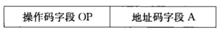
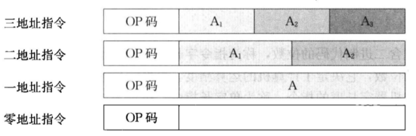
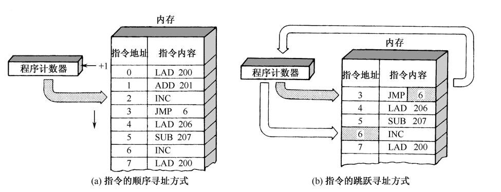
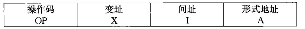
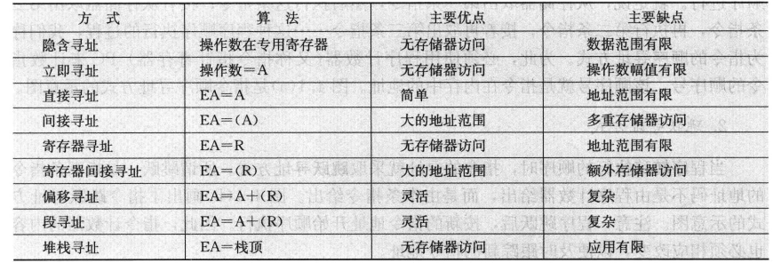
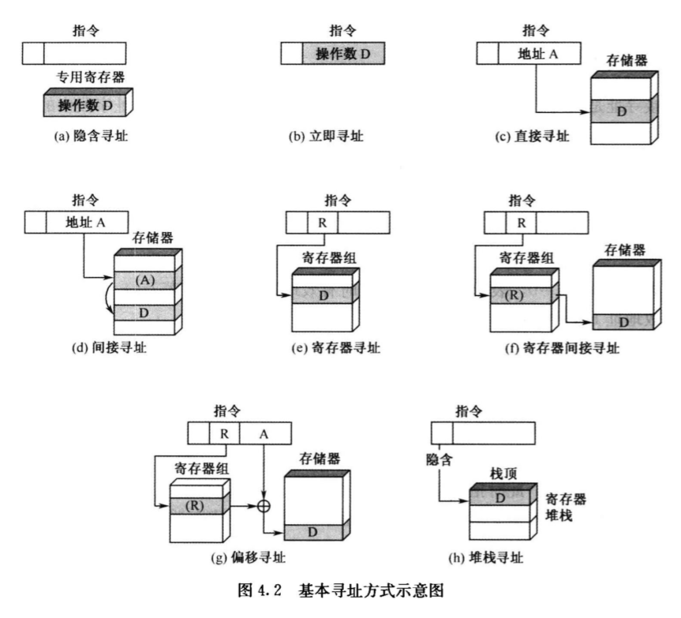

# 第4章 指令系统

## 1. 基本概念

计算机的指令有**微指令**、**机器指令**和**宏指令**之分。微指令是微程序级的命令，属于硬件；宏指令是由若干条机器指令组成的软件指令，属于软件；而**机器指令**介于两者之间，通常简称为**指令**，每一条指令可以完成一个独立的算术运算或逻辑运算操作

CISC：复杂指令系统计算机

RISC：精简指令系统计算机

## 2. 指令格式

机器指令是用机器字来表示的。表示一条指令的机器字，就称为**指令字**，简称指令

指令格式，指的是指令字用二进制代码表示的结构性质，通常由操作码字段和地址码字段组成

    

**操作码：**指令系统的每一条指令都要规定一个操作码，一个包含$n$位的操作码最多能够表示$2^n$条指令

**地址码：**

    

1. 零地址指令：指令字中只有操作码，而没有地址码。例如“关机指令”等控制类指令
2. 一地址指令：$(AC)op(A_1)\to A_1$，指定一个操作数，另一个操作数地址是隐含的
3. 二地址指令：$(A_1)op(A_2)\to A_1$
   - 存数器-存储器$(SS)$型
   - 寄存器-寄存器$(RR)$型
   - 寄存器-存储器$(RS)$型
4. 三地址指令：$(A_1)op(A_2)\to A_3$，$A_3$只是作为存放结果的地址

**指令字长度：**一个指令字中包含二进制代码的位数

**机器字长：**计算机能直接处理的二进制数据的位数

## 3. 指令和数据的寻址方式

在存储器中，操作数或指令字写入或读出的方式，有地址指定方式、相联存储方式和堆栈存取方式。当采用地址指定方式时，形成操作数或指令地址的方式，称为**寻址方式**。寻址方式分为两类，即指令寻址方式和数据寻址方式。

- 在冯·诺伊曼型结构的计算机中，内存中指令的寻址与数据的寻址是<u>交替进行</u>的，而哈佛型计算机中指令寻址和数据寻址是<u>独立进行</u>的

### 指令的寻址方式

1. 顺序寻址方式：用程序计数器（指令指针寄存器）来计数指令的顺序号，该顺序号就是指令在内存中的地址
2. 跳跃寻址方式：下条指令的地址码由本条指令给出

    

### 操作数基本寻址方式

形成操作数的有效地址的方法，称为操作数的寻址方式

一种单地址指令的结构如下：

    

形式地址$A$也称**偏移量**，它是指令字结构中给定的地址量。**寻址方式特征位**，此处由间址位和变址位组成，如果指令中指明要变址或间址变换，那么形式地址就要通过指定方式进行变换，才能形成有效地址。

根据$X,I,A$的组合，可构成图4.2中的各类寻址方式

    

    

## 4. 典型指令

一个较完善的指令系统，应当有**数据处理，数据存储，数据传送，程序控制**四大类指令

### 精简指令系统RISC

1. 选取使用频率最高的一些简单指令，指令条数少
2. 指令长度固定，指令格式种类少，寻址方式种类少
3. 只有取数/存储指令访问存储器，其余指令的操作数都在寄存器之间进行

