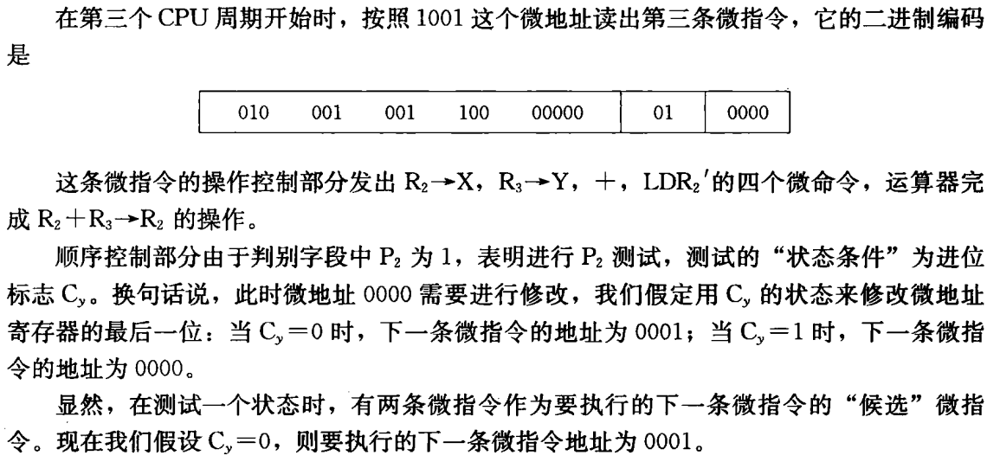
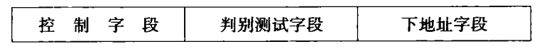

# 第5章 中央处理器

## 1. CPU的功能和组成

### 功能

指令控制，操作控制，时间控制，数据加工

### 基本组成

CPU=运算器+cache+控制器

    

#### 运算器

ALU，通用寄存器$(R_0\sim R_3)$，暂存器$(DR)$，状态字寄存器$(PSW)$

#### cache

指令cache$(PC,IBUS)$，数据cache$(AR,DBUS)$

#### 控制器

程序计数器$(PC)$，指令寄存器$(IR)$

#### 主要寄存器

数据缓冲寄存器$(DR)$，指令寄存器$(IR)$，程序计数器$(PC)$，数据地址寄存器$(AR)$，通用寄存器$(R_0\sim R_3)$，状态字寄存器$(PSW)$

#### 操作控制器

把许多寄存器之间传送信息的通路，称为**数据通路**。在各寄存器之间建立数据通路的任务，是由称为**操作控制器**的部件来完成

根据设计方法不同，操作控制器可分为时序逻辑型（**硬布线控制器**）和存储逻辑型（**微程序控制器**）两种

## 2. 指令周期

**指令周期：**取出一条指令并执行这条指令的时间

指令周期通常由若干个**CPU周期数**来表示，CPU周期称为**机器周期**，又称**时钟周期**

    

通常用内存中读取一个指令字的最短时间来规定CPU周期，一个CPU周期时间又包含有若干个$T$周期（节拍脉冲，处理操作的最基本单位）
由上图可以知道，取出和执行任何一条指令所需的最短时间为两个CPU周期

**单周期、多周期：**单周期就是一个CPU周期中完成取指和执行操作。大多数指令需要在多个CPU周期中完成指令周期的全部操作

- 注意：时钟周期通常定义为机器主频的倒数。**时钟周期不等于$T$周期**

### MOV传送指令

$MOV$指令是一条$RR$型指令

取指周期：从指存取出指令；对程序计数器$PC$加1，以便为取下一条指令做好准备；对指令操作码进行编译或测试，以便确定进行什么操作

执行周期：完成两个通用寄存器$R_0,R_1$之间的数据传送操作

    

#### 1. 取指周期

    

1. 程序计数器$PC$中装入第一条指令地址101（八进制）
2. $PC$的内容被放到指令地址总线$ABUS(I)$上，对指存进行译码，并启动读指令
3. 从101号地址读出的$MOV$指令通过指令总线$IBUS$装入指令寄存器$IR$
4. 指令寄存器中的操作码$(OP)$被译码
5. CPU识别出是$MOV$指令，取指周期结束

#### 2. 执行周期

    

1. 操作控制器$(OC)$送出控制信号到通用寄存器，选择$R_1$作源寄存器，$R_0$作目标寄存器
2. $OC$送出控制信号到$ALU$，指定$ALU$做传送操作
3. $OC$送出控制信号，打开$ALU$输出三态门，将$ALU$输出送到数据总线$DBUS$上（**注意：在任何时候DBUS上只能有一个数据**）
4. $OC$送出控制信号，将$DBUS$上的数据打入到数据缓冲寄存器$DR$
5. $OC$送出控制信号，将$DR$中的数据`10`打入到目标寄存器$R_0$，$MOV$指令执行结束

### LAD取数指令

$LAD$指令是$RS$型指令，它先从指令存储器取出指令，然后从数据存储器取出数据装入通用寄存器$R_1$。由于一次访问指存，一次访问数存，所以$LAD$指令周期需要3个CPU周期

    

#### 1. 取指周期

取指周期中，CPU的动作完全与$MOV$指令取指周期中一样，只是$PC$提供的指令地址不同。

$ADD,STO,JMP$三条指令的取指周期也与$MOV$完全相同

#### 2. 执行周期

    

1. 操作控制器$OC$发出控制命令打开$IR$输出三态门，将指令中的直接地址码`6`放到数据总线$DBUS$上
2. $OC$发出操作命令，将地址码`6`装入数存地址寄存器$AR$
3. $OC$发出读命令，将数存`6`号单元中的数`100`读出到$DBUS$上
4. $OC$发出命令，将$DBUS$上的数据`100`装入缓冲寄存器$DR$
5. $OC$发出命令，将$DR$中的数`100`装入通用寄存器$R_1$

- 数据总线$DBUS$上**分时进行了地址传送和数据传送**，所以需要2个CPU周期（**注意：在任何时候DBUS上只能有一个数据**）

### ADD加法指令

$ADD$指令是$RR$型指令，在运算器中用两个寄存器的数据进行加法运算。指令周期只需要**2个CPU周期**

#### 执行周期

    

1. 操作控制器$OC$送出控制命令到通用寄存器，选择$R_1$做源寄存器，$R_2$做目标寄存器
2. $OC$送出控制命令到$ALU$，指定$ALU$做$R_1(100)$和$R_2(20)$的加法操作
3. $OC$送出控制命令，打开$ALU$输出三态门，把运算结果120放到$DBUS$上
4. $OC$送出控制命令，将$DBUS$上数据打入缓冲寄存器$DR$；$ALU$产生的进位信号保存在状态字寄存器$PSW$中
5. $OC$送出控制命令，将$DR(120)$装入$R_2$

### STO存数指令

$STO$指令是$RS$型指令，指令周期需要**3个CPU周期**

    

#### 执行周期

    

1. 操作控制器$OC$送出操作命令到通用寄存器，选择$(R_3)=30$做数据存储器的地址单元
2. $OC$发出操作命令，打开通用寄存器输出三态门（不经$ALU$以节省时间），将地址30放到$DBUS$上
3. $OC$发出操作命令，将地址30打入$AR$，并进行数存地址译码
4. $OC$发出操作命令到通用寄存器，选择$(R_2)=120$，作为数存的写入数据
5. $OC$发出操作命令，打开通用寄存器输出三态门，将数据120放到$DBUS$上
6. $OC$发出操作命令，将数据120写入数存30号单元

- 因为$DBUS$是**单总线结构**，所以需要先送地址，后送数据，分时传送，花费2个CPU周期

### JMP转移指令

$JMP$指令用来改变程序的执行顺序，指令周期为**2个CPU周期**

    

#### 执行周期

    

1. $OC$发出操作控制命令，打开地址寄存器$IR$的输出三态门，将$IR$中的地址码`101`发送到$DBUS$上
2. $OC$发出操作控制命令，将$DBUS$上的地址码`101`打入到程序计数器$PC$中，$PC$中的原先内容被更换

### 方框图语言表示指令周期

    

- **一个方框代表一个CPU周期**，方框中的内容表示数据通路的操作或某种控制操作
- $DBUS$代表数据总线，$ABUS(D)$代表数存地址总线，$ABUS(I)$代表指存地址总线，$RD(D)$代表数存读命令，$WE(D)$代表数存写命令，$RD(I)$代表指存读命令

- $\sim$为公操作符号，表示一条指令已经执行完毕，转入公操作

## 3. 时序产生器和控制方式

硬布线控制器中，时序信号采用**主状态周期-节拍电位-节拍脉冲**三级体制

微程序控制器中，一般采用**节拍电位-节拍脉冲**二级体制

### 时序信号产生器

    

### 控制方式

- 同步控制方式：任何情况下，已定的指令在执行时所需的机器周期和时钟周期数不变。

  根据不同情况，可选取如下方案：

  - 采用完全统一的机器周期执行各种不同的指令
  - 采用不定长机器周期
  - 中央控制与局部控制的结合

- 异步控制方式：每条指令需要多长时间就占多长时间
- 联合控制方式：
  - 大部分指令在固定的周期内完成，少数难以确定的操作采用异步方式
  - 机器周期的节拍脉冲固定，但是各指令的机器周期数不固定（微程序控制器采用）

## 4. 微程序控制器

基本思想：仿照解题的方法，把操作控制信号编制成微指令，存放到控制存储器里。运行时，从控存中取出微指令，产生指令运行所需的操作控制信号。（用软件方法来设计硬件的技术）

### 4.1 微程序控制原理

#### 微命令与微操作

**微命令：**控制部件向执行部件发出的各种控制命令叫作微命令，它是**构成控制序列的最小单位**

**微操作：**微命令的操作过程，是**执行部件中最基本的操作**

- 微命令和微操作是一一对应的
- 微命令是微操作的控制信号，微操作是微命令的操作过程

由于数据通路的结构关系，微操作可分为**相容性**和**相斥性**两种

例如：ALU的加、减、传送在同一个CPU周期中只能选择一种，不能并行，所以$+,-,M$三个微操作是相斥性的微操作；而ALU的X输入微操作4，6，8分别与Y输入的5，7，9任意两个微操作都是相容性的

    

#### 微指令和微程序

**微指令：**把在同一CPU周期内并行执行的微操作控制信息，存储在控制存储器里，称为一条微指令

    

操作控制字段：用以产生某一步操作所需的各个微操作控制信号

- 某位为1，表明发微指令
- 微指令发出的控制信号都是节拍电位信号，持续时间为1个CPU周期

顺序控制字段：用以控制产生下一条要执行的微指令地址

**微程序：**一系列微指令的有序集合就是微程序

- 一段微程序对应一条机器指令

#### 微程序控制器原理框图

微程序控制器主要由**控制存储器**、**微指令寄存器**和**地址转移逻辑**三大部分组成，其中微指令寄存器分为微地址寄存器和微命令寄存器两部分

    

**控制存储器$(\mu CM)$：**微程序控制器的核心部件，用来存放微程序

**微指令寄存器$\mu IR$：**用来存放从$\mu CM$取出的正在执行的微指令，它的位数同微指令字长相等。

#### 微程序举例-十进制加法

”十进制加法“采用BCD码完成，当两数相加的和数小于等于9时，结果正确；当和数大于9时，必须进行加6修正才能得到正确结果

假定指令存放在指存中，数据`a,b`及常数`6`存放在图5.2中的$R_1,R_2,R_3$三寄存器中，则微程序流程图如下：

每一条微指令用一个长方框表示，菱形符号代表判别测试，每一条微指令的地址用数字示于长方框右上角。执行周期要求先进行$a+b+6$运算，然后判断结果有无进位：当进位表示$C_y=1$，不减`6`；当$C_y=0$，减去`6`，从而获得正确结果

    

<left>
    
</left>

<left>
    
</left>

<left>
    
</left>

<left>
    
</left>

#### CPU周期与微指令周期关系

**微指令周期**等于读出微指令的时间加上执行该微指令的时间。为了保证整个机器控制信号的同步，可以将一个微指令周期时间设计得恰好和CPU周期时间相等

    

#### 机器指令与微指令的关系

一条机器指令对应一个微程序，该微程序是由若干条微指令序列组成的。

    

### 4.2 微程序设计技术

#### 微命令的编码方法

**直接表示法：**操作控制字段中的每一位代表一个微命令

- 缺点：微指令字较长，因为使控制存储器容量较大

    

**编码表示法：**把一组相斥性的微命令信号组成一个字段，通过字段译码器对每一个微命令信号进行译码，译码输出作为操作控制信号

- 优点：可以避免互斥，使指令字大大缩短
- 缺点：增加了译码电路，使微程序的执行速度减慢

#### 微地址的形成方法

微指令执行的顺序控制问题，实际上是如何确定下一条微指令的地址问题

**计数器方式：**微程序顺序执行时，其后继微地址就是现行微地址加上一个增量；当微程序遇到转移或转子程序时，由微指令的转移地址段来形成转移微地址。

- 优点：简单、易于掌握，编制微程序容易
- 缺点：不能实现两路以上的并行微程序转移，因而不利于提高微程序的执行速度

**多路转移方式：**当微程序不产生分支时，后继微地址直接由微指令的顺序控制字段给出；当出现分支时，根据顺序控制字段的”判别测试“标志和”状态条件“信息来选择其中一个微地址

#### 微指令格式

**水平型微指令：**一次能定义并能并行执行多个微命令的微指令

    

**垂直型微指令：**微指令中设置微操作码字段，采用微操作码编译法，由微操作码规定微指令的功能。一条微指令中只有1~2个微操作命令

比较：

1. 水平型微指令并行操作能力强，效率高，灵活性强，垂直型微指令则较差
2. 水平型微指令执行一条指令的时间短，垂直型微指令执行时间长
3. 由水平型微指令解释指令的微程序，有微指令字较长而微程序短的特点。垂直型微指令则相反
4. 水平型微指令用户难以掌握，而垂直型微指令与指令比较相似，相对来说，比较容易掌握

## :question:5. 硬连线控制器

实现方法：通过逻辑电路直接连线而产生的，又称为组合逻辑控制方式

    

**控制信号产生：**硬联线控制器中，某一微操作控制信号$C$是指令操作码译码器输出$I_m$、时序信号（节拍电位$M_i$，节拍脉冲$T_k$）和状态条件信号$(B_j)$的逻辑函数，即
$$
C=f(I_m,M_i,T_k,B_j)
$$

    

> <left>
>     
> </left>
>
> <left>
>     
> </left>

## 6. 流水CPU

### 6.1 并行处理技术

- 时间并行（重叠）：让多个处理过程在时间上相互错开，轮流使用同一套硬件设备的各个部件，以加快硬件周转而赢得速度
- 空间并行（资源重复）：以数量取胜，真正体现同时性
- 时间+空间并行：Pentium中采用的超标量流水线技术

### 6.2 流水CPU结构

#### 组成

CPU按流水线方式组织，通常由三大部分组成：指令部件、指令队列、执行部件。这三个功能部件可以组成一个3级流水线

    

#### 时空图

下图表示流水CPU中一个指令周期的任务分解，分别是：取指令$IF$、指令译码$ID$、执行运算$EX$、结果写回$WB$，每个子过程称为过程段$(S_i)$

    

- 一般的流水计算机只有一条指令流水线，而超标量流水具有两条以上的指令流水线

#### 分类

- 指令流水线：指令步骤并行
- 算术流水线：运算操作步骤并行
- 处理机流水线：程序步骤并行

### 6. 3 流水线中主要问题

#### 资源相关

多条指令进入流水线后在**同一机器时钟周期内争用同一个功能部件**所产生的冲突。

假设一条指令流水线有5段组成，其中第$I_1$条的$MEM$段与$I_4$条的$IF$段都要访问存储器。当数据和指令放在同一个存储器且只有一个访问口时，便发生两条指令争用存储器资源的相关冲突。

解决冲突的办法：

1. 第$I_4$条指令停顿一拍后再启动
2. 二是增设一个存储器，将指令和数据分别存放在两个存储器中

    

#### 数据相关

一个程序中，如果必须等前一条指令执行完毕后，才能执行后一条指令，那么这两条指令就是数据相关的

分为3种情况：读后写$(RAW)$，写后写$(WAW)$，写后读$(WAR)$

多条指令重叠处理时，当**后继指令所需的操作数，刚好是前一指令的运算结果**时，便发生”先读后写“的数据相关冲突$(RAW)$

    

解决冲突办法：在流水CPU的运算器中特意设置若干运算结果缓冲寄存器，暂时保留运算结果，以便于后继指令直接使用，称为”向前“或定向传送技术

#### 控制相关

控制相关冲突由转移指令引起。当执行转移指令时，依据转移条件的产生结果，可能为顺序取下条指令；也可能转移到新的目标地址取指令，从而使流水线发生断流

解决冲突办法：

1. 延迟转移法
2. 转移预测法

#### 例题

> <left>
>     
> </left>

<left>
    
</left>

