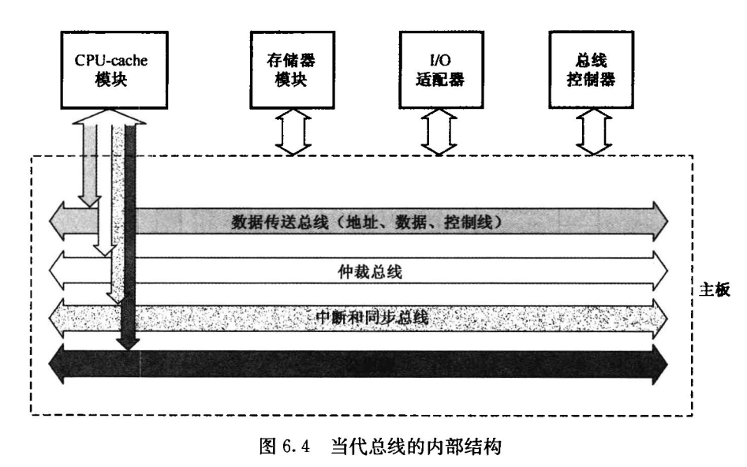

# 第6章 总线系统

## 1. 基本概念

总线带宽：总线本身所能达到的最高传输速率（$MB/s$）

> <left>
>     
> </left>

### 连接方式

1. 单总线结构

   在单总线结构中，要求连接到总线上的逻辑部件必须高速运行。

   

       
   

2. 多总线结构

   多总线结构体现了高速、中速、低速设备连接到不同的总线上同时进行工作，以提高总线的效率和吞吐量，而且处理器结构的变化不影响高速总线

   

       
   

### 内部结构

整个总线分成4部分：数据传送总线，仲裁总线，中断和同步总线，公用线

    

## 2. 总线接口

### 信息传送方式

串行传送：使用一条传输线，采用脉冲传送，按顺序传送一个数码的所有二进制位的脉冲信号

并行传送：每一数据位都需要单独一条传输线，使得数码的所有二进制位可以在不同的线上同时进行传送

    

分时传送：

1. 采用总线复用方式，某个传输线上即传送地址信息，又传送数据信息。
2. 共享总线的部件分时使用总线

### 总线接口

接口：CPU和主存、外设之间通过总线进行连接的逻辑部件

接口的典型功能：控制、缓冲、状态、转换、整理、程序中断。

    

一个$I/O$接口模块有两个接口：①是和系统总线的接口，数据交换一定采用**并行方式**；②是和外设的接口

> <left>
>     
> </left>

## 3. 总线仲裁

连接到总线上的功能模块有主动和被动两种形态，其中主方可以启动一个总线周期，而从方只能响应主方请求。每次总线操作，只能有一个主方，但是可以有多个从方。为了解决多个功能模块争用总线的问题，必须设置总线仲裁部件。

总线占用期：主方持续控制总线的时间

### 集中式仲裁

**链式查询方式：**离中央仲裁器最近的设备具有最高优先权，离总线控制器越远，优先权越低

- 优点：只用很少几根线就能按一定优先次序实现总线控制；这种链式结构很容易扩充设备
- 缺点：对询问链的电路故障很敏感；优先级固定

总线授权信号$BG$串行地从一个$I/O$接口传送到下一个$I/O$接口。假如$BG$到达的接口有总线请求，$BG$信号便不再往下循环，该$I/O$接口就获得了总线控制权

    

**计时器定时查询方式：**总线上的任一设备要求使用总线时，通过$BR$线发出总线请求。总线仲裁器接到请求信号以后，在$BS$线为”0“的情况下让计数器开始计数，计数值通过一组地址线发向各设备。每个设备接口都有一个设备地址判别电路，当地址线上的计数值与请求总线的设备地址相一致时，该设备置”1“$BS$线，获得了总线使用权。

每次计数可以从”0“开始，也可以从中止点开始。如果从”0“开始，各设备的优先次序与链式查询法相同，优先级的顺序是固定的。如果从中止点开始，则每个设备使用总线的优先级相等

- 优点：计数器的初值可以用程序修改，方便改变优先次序
- 缺点：增加线数

    

**独立请求方式：**每一个共享总线的设备均有一对总线请求线$BR_i$和总线授权线$BG_i$。当设备要求使用总线时，便发出该设备的请求信号。总线仲裁器中有一个排队电路，它根据一定的优先次序决定首先响应哪个设备的请求，并给设备以授权信号

- 优点：响应时间快；对优先次序的控制也相当灵活

    

### 分布式仲裁

不需要中央仲裁器，而是多个仲裁器竞争使用总线。当它们有总线请求时，把它们唯一的仲裁号发送到共享的仲裁总线上，每个仲裁器将仲裁总线上得到的号与自己的号进行比较。如果仲裁总线上的号大，则它的总线请求不予响应，并撤消它的仲裁号。最后，获胜者的仲裁号保留在仲裁总线上。

显然，分布式仲裁是以优先级仲裁策略为基础。

## 4. 总线的定时和数据传送模式

### 定时

总线的信息传送过程：请求总线、总线仲裁、寻址、信息传送、状态返回

定时：事件出现在总线上的时序关系，分为**同步定时**和**异步定时**

### 数据传送模式

    

