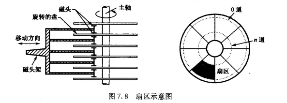
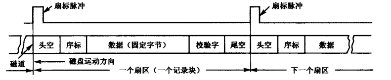
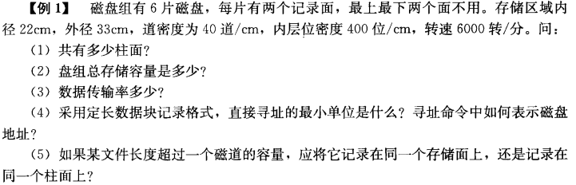
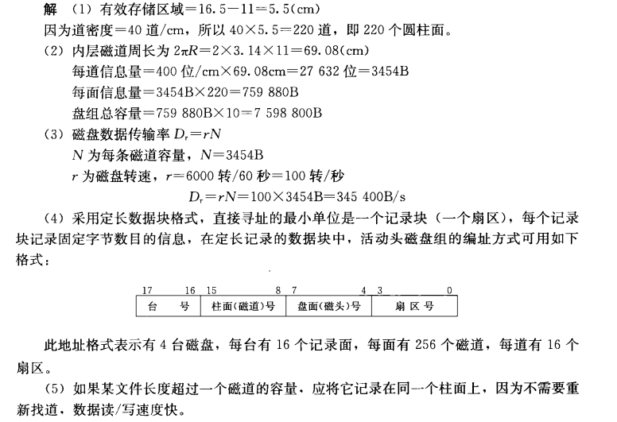
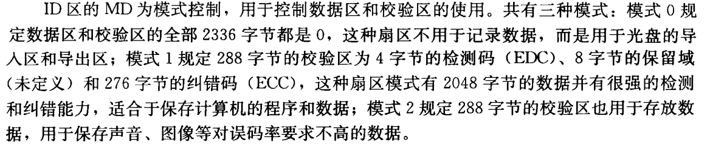
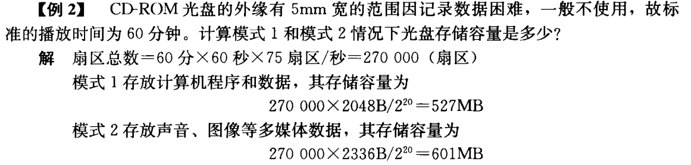

# 第7章 外存与I/O设备

## 1. 磁盘存储设备

盘片的上下两面都能记录信息，通常把磁盘片表面称为记录面。记录面上一系列同心圆称为**磁道**，每个磁道又分为若干个**扇区**。

在磁道上，信息是按区存放的，每个区中存放一定数量的字或字节，各个区存放的字或字节数是相同的。每个扇区记录定长的数据，因此读/写操作是以扇区为单位一位一位串行进行的，每一个扇区记录一个记录块

    

    

### 技术指标

- 存储密度

  1. 道密度：沿磁盘半径方向单位长度上的磁道数
  2. 位密度：磁道单位长度上能记录的二进制代码位数
  3. 面密度：位密度和道密度的乘积

- 存储容量：一个磁盘存储器所能存储的字节总数（格式化容量，非格式化容量）

- 平均存取时间：找道时间，等待时间，数据传送时间
  $$
  T_n=T_s+\frac{1}{2r}+\frac{b}{rN}
  $$
  式中，$T_s$表示平均找道时间，$\frac{1}{2r}$表示平均等待时间，$\frac{b}{rN}$表示数据传送时间。其中$r$表示磁盘旋转速率，$b$表示传送的字节数，$N$表示每磁道字节数

- 数据传输率：假设磁盘旋转速度为$n$转/秒，每条磁道容量为$N$个字节，则$D_r=nN$

> <left>
>     
> </left>
>
> <left>
>     
> </left>

## 2. 光盘和磁光盘存储设备

### CD-ROM只读型光盘

光盘上的信息以坑点形式分布，有坑点表示为1，无坑点表示为0

信息记录的轨迹称为光道。光道上划分出一个个扇区，是光盘的最小可寻址单位

光盘的扇区地址编码以分$(MN)$，秒$(SC)$，分数秒$(FR,1/75s)$时间值作为地址。由于光盘的恒定线速度是每秒钟读取75个扇区，故$FR$的值实际上就是秒内的扇区号$(0\sim 74)$

$ID$区的$MD$为模式控制，用于控制数据区的校验区的使用。

<left>
    
</left>

> <left>
>     
> </left>

