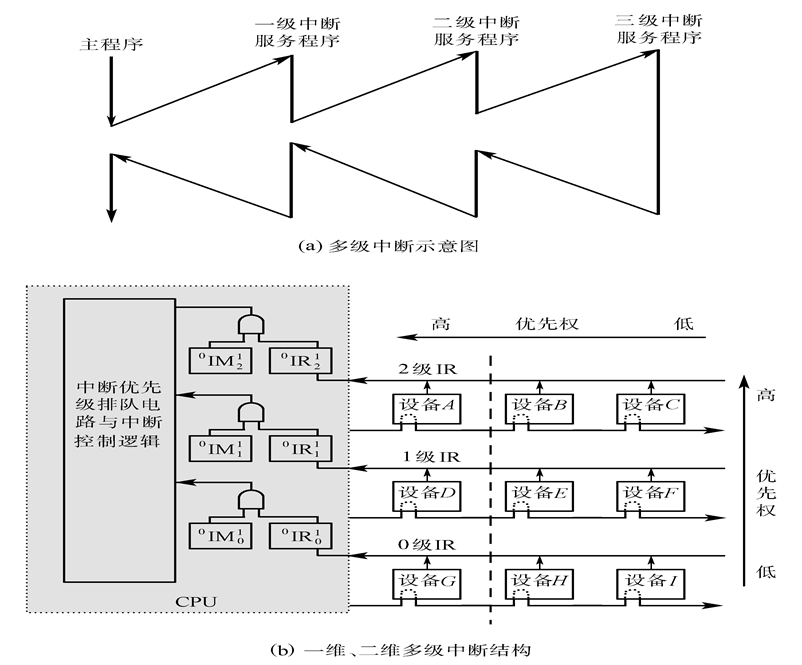

# 第8章 输入输出系统

## 1. 信息交换方式

    

## 2. 程序查询方式

数据在CPU和外围设备之间的传送**完全靠计算机程序控制**。当需要输入/输出时，CPU暂停执行主程序，转去执行设备输入/输出的服务程序。因为外围设备动作很慢，程序进入查询循环时将白白浪费掉CPU很多时间。

### 设备编址

统一编址，单独编址

### 输入/输出指令

<left>
    
</left>

### 接口

设备选择电路、数据缓冲寄存器、设备状态标志

    

### 程序查询输入/输出方式

程序查询方式利用程序控制实现CPU和外部设备之间的数据传送，过程如下：

<left>
    
</left>

## 3. 程序中断方式

当某一外设的数据准备就绪后，”主动“向CPU发出请求中断的信号，请求CPU暂时中断目前正在执行的程序而进行数据交换。

    

    

### 基本I/O接口

    

### 单级中断

所有中断源属于同一级，离CPU越近，优先级越高

**中断源的识别：**串行排队链法

中断向量：当CPU响应中断时，由硬件直接产生一个固定的地址(即向量地址)。由向量地址指出每个中断源设备的中断服务程序入口，这种方法通常称为向量中断。

### 多级中断

每级有一个中断优先权，分为一维多级中断和二维多级中断

- 一个系统有n级中断，则CPU中有n个IR，n个IM，某级中断被响应后，则关闭本级和低于本级的IM，开放更高级的IM。

- 多级中断可以嵌套，但同一级的中断不允许嵌套

- 中断响应时，确定哪一级中断和中断源采用硬件实现。采用了独立请求方式和链式查询方式相结合的方式。

- 使用多级堆栈保存现场（包括IM）

    

### 中断控制器

    

## 4. DMA方式

### 传送方式

1. 停止CPU访问内存
2. 周期挪用方式
3. DMA与CPU交替访问

