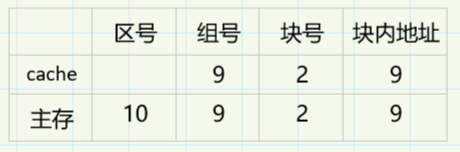
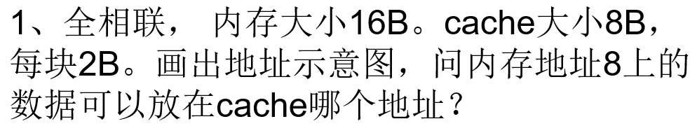
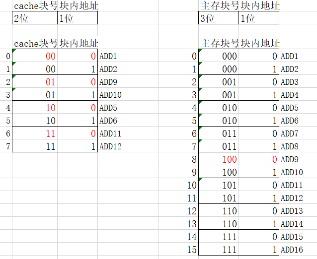
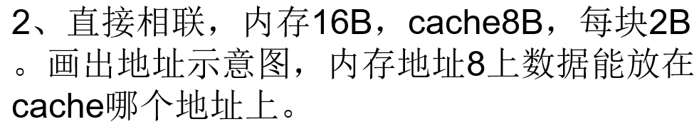
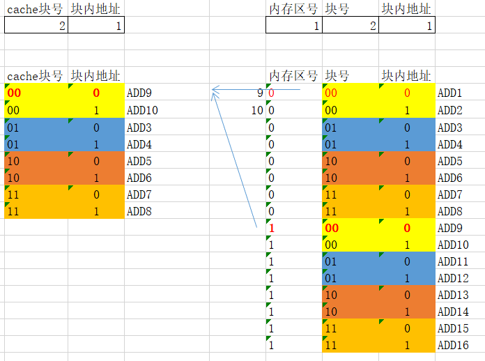
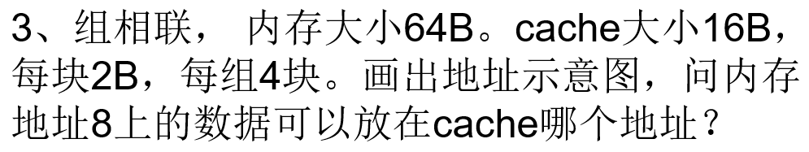
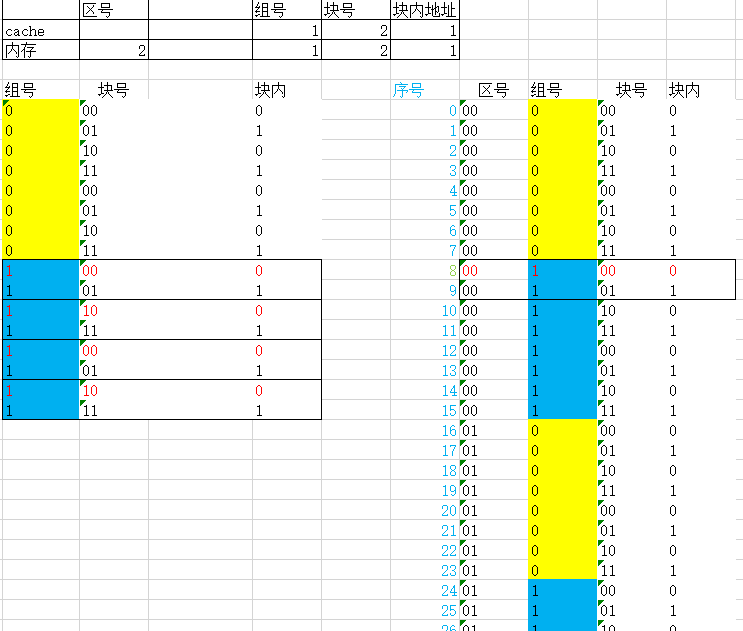

# cache存储系统

> 已知cache和主存之间采用组相联方式。主存大小1GB，cache大小1MB，其中每块512B，每组4块
>
> 画出内存和cache的地址图

<left>
    
</left>
-----

> <left>
>     
> </left>

每块2B$\Rightarrow$每块(行)中包含2个字

$\frac{8B}{2B}=4\Rightarrow$cache分为4块

$\frac{16B}{2B}=8\Rightarrow$主存分为8块

    

因为是全相联映射，所以内存地址8上的数据可以**放在任意cache块中，但在块内的位置是固定的**（图中红色部分）

查找过程：根据主存地址`1000`，其中`100`是主存块号，`0`是块内偏移地址。查找cache的所有行(块)，如果某一行`tag`域等于`100`，说明命中，取命中块号+块内偏移地址访问cache

-----

> <left>
>     
> </left>

每块$2B\Rightarrow$每块(行)中包含2个字

$\frac{8B}{2B}=4\Rightarrow$cache分为4行(块)

$\frac{16B}{2B}=8\Rightarrow$主存分为8块，$\frac{8}{4}=2\Rightarrow$主存分块后，以cache的行数为标准进行分区，分为2个区

    

内存地址8位于主存第4块(从0开始)，根据直接相联映射，只能映射到cache的第$4\%4=0$块上，并且在块内的位置是固定的

查找过程：由主存地址为`1000`，可知块号为`00`，直接查cache的`00`行(块)，如果其`tag`域等于1，说明命中，取块号+块内地址访问cache，既`00+0=000`

-----

> <left>
>     
> </left>

$\frac{16B}{4*2B}=2\Rightarrow$cache分为2组，每组4行，每行2个字

$\frac{64B}{4*2B}=8\Rightarrow$主存以cache的分组为标准进行分组，分为8大组（区号+组号）

$\frac{8}{2}=4\Rightarrow$将主存的大组再次细分，分为4个区，每个区包含2组，既最终**每个区内的分组方式与cache完全相同**

    

内存地址8位于主存第1块(从0开始)，根据组相联映射，只能映射到cache的第$1\%2=1$组上，但可以放在组内的任意行里

