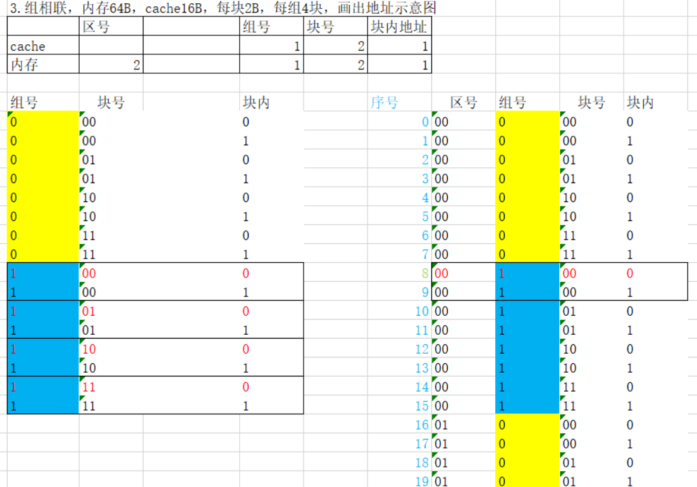

# cache存储系统

[参考PPT](https://wenku.baidu.com/view/1d5b1031aef8941ea66e0523.html)：包含详细的操作过程

> <left>
>     
> </left>

每块2B$\Rightarrow$每块(行)中包含2个字

$\frac{8B}{2B}=4\Rightarrow$cache分为4行

$\frac{16B}{2B}=8\Rightarrow$主存分为8块，即8行

    

因为是全相联映射，所以内存地址8上的数据可以**放在任意cache块中，但在块内的位置是固定的**（图中红色部分）

查找过程：访问内存单元1000时：取地址码高3位的100依次与cache的4行的标记`tag`进行比较。假如在第01行**命中**，则访问该行的第0号单元，即内存地址1000映射到cache地址010；假如没有**命中**，则根据替换策略，把内存的第100块（即1000至1001）的内容调入cache，并用100覆盖该行的`tag`

-----

> <left>
>     
> </left>

每块$2B\Rightarrow$每块(行)中包含2个字

$\frac{8B}{2B}=4\Rightarrow$cache分为4行

$\frac{16B}{2B}=8\Rightarrow$主存分为8块

$\frac{8}{4}=2\Rightarrow$主存分块后，以cache的行数为标准进行分区，分为2个区

    

内存地址8位于主存第4块(从0开始)，根据直接相联映射，**只能映射到**cache的第$4\%4=0$块上，并且在块内的位置是固定的

查找过程：访问内存单元1000时：取地址码高1位的区号1与cache的第00行的`tag`进行比较，如果命中，则访问该行的第0号单元，即内存地址1000映射到cache地址000

-----

:question:【不太确定】

> <left>
>     
> </left>

$\frac{16B}{4*2B}=2\Rightarrow$cache分为2组，每组4行，每行2个字

$\frac{64B}{4*2B}=8\Rightarrow$主存以cache的分组为标准进行分组，分为8大组（区号+组号）

$\frac{8}{2}=4\Rightarrow$将主存的大组再次细分，分为4个区，每个区包含2组，即最终**每个区内的分组方式与cache完全相同**

    

内存地址8位于主存第1块(从0开始)，根据组相联映射，只能映射到cache的第$1\%2=1$组上，但可以放在组内的任意行里

查找过程：访问内存单元001000时：取地址码高2位的组号00与cache的第1组的4行的`tag`进行比较，假设在第01行命中，则访问该行的第0号单元，即内存地址001000映射到cache地址1010

