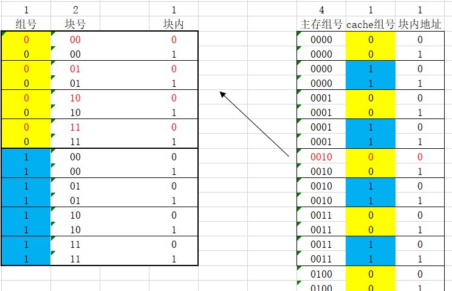

# cache存储系统

[参考PPT](https://wenku.baidu.com/view/1d5b1031aef8941ea66e0523.html)：包含详细的操作过程

> <left>
>     
> </left>

每块2B$\Rightarrow$每块(行)中包含2个字

$\frac{8B}{2B}=4\Rightarrow$cache分为4行

$\frac{16B}{2B}=8\Rightarrow$主存分为8块，即8行

    

因为是全相联映射，所以内存地址8上的数据可以**放在任意cache块中，但在块内的位置是固定的**（图中红色部分）

查找过程：访问内存单元1000时：取地址码高3位的100依次与cache的4行的标记`tag`进行比较。假如在第01行**命中**，则访问该行的第0号单元，即内存地址1000映射到cache地址010；假如没有**命中**，则根据替换策略，把内存的第100块（即1000至1001）的内容调入cache，并用100覆盖该行的`tag`

-----

> <left>
>     
> </left>

每块$2B\Rightarrow$每块(行)中包含2个字

$\frac{8B}{2B}=4\Rightarrow$cache分为4行

$\frac{16B}{2B}=8\Rightarrow$主存分为8块

$\frac{8}{4}=2\Rightarrow$主存分块后，以cache的行数为标准进行分区，分为2个区

    

内存地址8位于主存第4块(从0开始)，根据直接相联映射，**只能映射到**cache的第$4\%4=0$块上

查找过程：访问内存单元1000时：取地址码高1位的区号1与cache的第00行的`tag`进行比较，如果命中，则访问该行的第0号单元，即内存地址1000映射到cache地址000

-----

> <left>
>     
> </left>

组相联有两种方式：

1. 主存将cache作为模板，以此划分出若干个区

    

$\frac{16B}{4*2B}=2\Rightarrow$cache分为2组，每组4行，每行2个字

主存按照此模板进行划分后，$\frac{64B}{16B}=4$，产生4个组

- 最终主存的低位部分地址结构与cache相同，多出来的位就成为了区号

    

2. 主存中不设区号，其地址格式为：$(主存组号，cache组号，块内地址)$，其中块内地址由块大小决定，cache组号由cache的分组决定，剩下的位数全部作为主存组号，同时也作为比较时的`tag`（标记部分）

    

$\frac{16B}{4*2B}=2\Rightarrow$cache分为2组，每组4行，每行2个字

因此主存的地址格式应该是：$(4,1,1)$，其中的cache组号反映出主存映射到cache的组号

    

