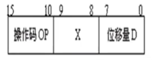
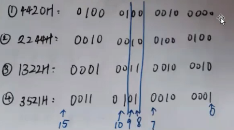

# 指令格式

> 某机指令格式如下：
>
> 

>     
> 

>
> 其中，X为寻址特征位。
>
> X=00：直接寻址；	
>
> X=01：用变址寄存器$R_{x1}$寻址；	
>
> X=10：用变址寄存器$R_{x2}$寻址；	
>
> X=11：相对寻址
>
> 设$(PC)=1234H,\ (R_{x1})=0037H,\ (R_{x2})=1122H$，请确定下列指令中的有效地址：
>
> ①`4420H`	②`2244H`	③`1322H`	④`3521H`

将四条指令转换为二进制：

    

1. `4420H`的8-9位是`00`，代表直接寻址，即偏移地址此时就是有效地址，因此其有效地址为：`0020H`

2. `2244H`的8-9位是`10`，代表用变址寄存器$R_{x2}$寻址，因此给变址寄存器加上偏移地址，也就是`1122H+44H=1166H`，所以有效地址为：`1166H`
3. `1322H`的8-9位是`11`，采用相对寻址，就是将$(PC)$地址加上偏移地址，即`1234H+22H=1256H`
4. 与2同理，`0021H+0037H=0058H`，其有效地址为：`0058H`

